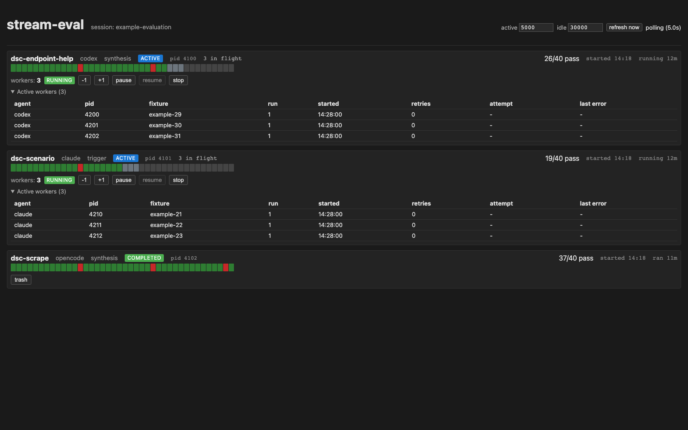

# stream-eval

Deterministic trigger and synthesis evaluation for Agent Skills. stream-eval runs the same fixture format against Claude Code, Codex, or OpenCode, normalizes each native JSONL transcript into portable actions, and records the selected agent and model with every result.



## Install

For a global installation with [pipx](https://pipx.pypa.io/stable/how-to/install-pipx/):

```bash
pipx install git+https://github.com/j-256/stream-eval.git
```

For development:

```bash
git clone https://github.com/j-256/stream-eval.git stream-eval
cd stream-eval
python3 -m venv .venv
source .venv/bin/activate
pip install -e '.[dev]'
```

Development branches and pull requests start from stable `source`, not generated `main`. See [CONTRIBUTING.md](CONTRIBUTING.md).

The selected agent CLI must already be installed and authenticated. Verify the harness and supported adapters with:

```bash
stream-eval trigger --help
stream-eval synthesis --help
claude --version
codex --version
opencode --version
```

## Quick start

Claude remains the default for compatibility with existing invocations:

```bash
stream-eval trigger \
  --agent claude \
  --skill-path skills/example \
  --eval evals/example/trigger-eval.json \
  --runs 3 --workers 4 \
  --out evals/example/runs/claude/results.json
```

Select Codex with the same fixture and skill paths:

```bash
stream-eval trigger \
  --agent codex \
  --skill-path skills/example \
  --eval evals/example/trigger-eval.json \
  --runs 3 --workers 4 \
  --out evals/example/runs/codex/results.json
```

OpenCode uses the same portable fixtures:

```bash
stream-eval trigger \
  --agent opencode \
  --skill-path skills/example \
  --eval evals/example/trigger-eval.json \
  --runs 3 --workers 4 \
  --out evals/example/runs/opencode/results.json
```

Set `STREAM_EVAL_AGENT` when every command in a shell should use the same adapter. Set `STREAM_EVAL_MODEL` only to an identifier accepted by that adapter. If it is unset, Claude uses `sonnet` and Codex uses its CLI default. OpenCode uses the backend default under `isolated` or `restricted`, while `inherit` may load a model default from the user's config. OpenCode model identifiers use the `provider/model` form.

## Evaluation model

stream-eval has two scoring layers:

- Trigger asks whether the target skill activated for each positive fixture and stayed inactive for each decline fixture
- Synthesis additionally evaluates final text, normalized actions, generated artifacts, or backend-native tool events

Each spawn runs in a detached disposable git worktree at the tested repository's `HEAD`. The default `isolated` profile also gives it a temporary home containing only the skill under test and any explicit siblings passed through `--also-install`.

The runner, adapters, and scorer have separate responsibilities:

```text
fixtures -> runner -> agent adapter -> native JSONL
              |              |              |
              |              |              v
              |              +------> transcript normalizer
              |                             |
              v                             v
       worktree isolation <---------- portable actions
              |                             |
              +-----------> scorer <--------+
                                |
                                v
                         results + dashboard
```

## Agent adapters

The adapter boundary owns the executable, command flags, isolated skill location, nested-session environment cleanup, and native event classification.

| Capability | Claude Code | Codex | OpenCode |
|---|---|---|---|
| Invocation | `claude -p` with stream JSON | `codex exec --json --ephemeral` | `opencode run --format json` |
| Isolated skill location | `<temp-home>/.claude/skills` | `<temp-home>/.agents/skills` | `<temp-home>/.opencode/skills` |
| Skill activation signal | Explicit `Skill` tool call | First command that reads the target `SKILL.md` | Explicit `skill` tool call |
| Final answer | `result.result` | Completed `agent_message` item | Completed `text` event |
| Retry telemetry | Native `api_retry` events | Not exposed by JSONL output | Not exposed by JSONL output |
| Generated files | Native tools plus disposable worktree artifacts | `file_change` items plus disposable worktree artifacts | Native tools plus disposable worktree artifacts |

Codex does not emit a dedicated skill-activation item. stream-eval therefore treats a command that reads the known target skill's `SKILL.md` as activation and inserts a normalized `skill` action immediately before the corresponding `command` action. This rule is narrow: reading another source skill does not count unless that skill is one of the expected names supplied by the fixture or harness.

OpenCode exposes native `skill`, `bash`, `read`, `write`, `edit`, `apply_patch`, `webfetch`, and `task` calls through JSONL `tool_use` events. stream-eval retains the native calls and maps them to the same portable action vocabulary used by the other adapters. The adapter follows OpenCode's [CLI](https://opencode.ai/docs/cli/) and [skill discovery](https://opencode.ai/docs/skills/) contracts.

Retry-budget exhaustion is available only when an adapter reports retry events. Claude runs exclude reported backoff windows from the effective timeout and abort the whole evaluation when the CLI exhausts its retry budget. Codex and OpenCode runs use the wall-clock safeguards and report zero native retries because their JSONL protocols do not expose that telemetry.

Agent and model are measurement dimensions. Keep them explicit in result paths and iteration notes, and do not combine runs from different adapters into one baseline without separating those dimensions.

## Fixture schemas

### Trigger fixtures

`trigger-eval.json` is a flat array:

```json
[
  {
    "name": "positive-example",
    "query": "Use the example workflow for this request",
    "should_trigger": true
  },
  {
    "name": "decline-example",
    "query": "Explain an unrelated concept",
    "should_trigger": false
  }
]
```

| Field | Required | Description |
|---|---|---|
| `query` | yes | Prompt sent to the selected agent |
| `should_trigger` | yes | Whether activating the target skill is correct |
| `name` | no | Stable fixture id; omitted values receive a non-colliding `qN` id |

A fixture passes when the majority activation outcome matches `should_trigger`.

### Synthesis fixtures

`synthesis-eval.json` uses named fixtures with typed assertions:

```json
[
  {
    "name": "portable-command-and-citation",
    "query": "Run the documented workflow and cite the public reference",
    "expected_skill": "example",
    "hypothesis": "The skill activates, runs its helper, and cites the public source",
    "assertions": [
      {
        "kind": "action_input_matches",
        "action": "command",
        "field": "command",
        "pattern": "scripts/example",
        "because": "The documented helper owns this lookup"
      },
      {
        "kind": "final_text_matches",
        "pattern": "https://example\\.com/reference",
        "because": "The answer must expose a portable public citation"
      }
    ]
  }
]
```

| Field | Required | Description |
|---|---|---|
| `name` | yes | Unique fixture id used in transcripts and results |
| `query` | yes | Prompt sent to the selected agent |
| `expected_skill` | no | Target skill expected as the first normalized action |
| `hypothesis` | no | Human-readable intent copied into the result |
| `assertions` | no | Typed checks; an empty array leaves only `expected_skill` |

Portable assertion kinds work across adapters:

| Kind | Required fields | Behavior |
|---|---|---|
| `final_text_matches` | `pattern` | Regex must match the final answer |
| `final_text_excludes` | `pattern` | Regex must not match the final answer |
| `action_input_matches` | `action`, `field`, `pattern` | A normalized action field must match |
| `action_sequence_includes` | `pattern` | Regex must match the newline-joined normalized action names |
| `artifact_content_matches` | `pattern`; optional `path` | A captured artifact's content must match, optionally after filtering paths by regex |

Normalized action names include `skill`, `command`, `read`, `file_change`, `web_fetch`, `mcp`, and `agent`. Adapter-native names remain available through `tool_input_matches` and `tool_sequence_includes` for legacy or intentionally backend-specific fixtures. A native assertion should be labeled and maintained as an agent-specific measurement.

Every assertion should carry a `because` field that states the durable contract behind the regex.

### Artifact assertions and contamination

Synthesis spawns may write inside their disposable worktree or to an explicit temporary output path so file-producing skills can be evaluated. stream-eval captures text files up to its safety limit from the disposable worktree, explicit native write payloads, and adapter-reported file changes under the system temporary directory. New untracked files are ordinary artifacts. Changes to tracked files are also captured, but they mark the run as worktree-contaminated because the answer was produced against state that differed from `HEAD`. Reported paths outside the worktree and system temporary directory are not read.

Trigger spawns keep the disposable worktree read-only because activation evaluation does not require generated files.

## Command reference

Common options:

| Flag | Description |
|---|---|
| `-a, --agent {claude,codex,opencode}` | Adapter to run; defaults to `STREAM_EVAL_AGENT` or `claude` |
| `-e, --eval PATH` | Trigger or synthesis fixture file |
| `-o, --out PATH` | Results JSON destination |
| `-s, --skill-path PATH` | Skill directory containing `SKILL.md`; required by `isolated` |
| `--skill-name NAME` | Override or supply the target skill name |
| `-i, --also-install PATH` | Install a sibling skill in the isolated home; repeatable |
| `-p, --profile PROFILE` | `isolated`, `restricted`, or `inherit` |
| `-r, --runs N` | Runs per fixture |
| `-w, --workers N` | Concurrent agent CLI subprocesses |
| `-t, --timeout SECONDS` | Effective per-run timeout |
| `-c, --cwd PATH` | Repository used to create disposable worktrees |

Synthesis also accepts `-l, --lenient`, which changes its default all-runs requirement to a majority-pass requirement. `--skill-name` remains long-only because `-s` selects the more common skill path.

Profiles:

| Profile | Skills visible | Integrations | Intended use |
|---|---|---|---|
| `isolated` | Only `--skill-path` and `--also-install` | MCP and subagents disabled | Reproducible default |
| `restricted` | User-installed skills | MCP and subagents disabled | Sibling displacement against a real catalog |
| `inherit` | User-installed skills | User configuration retained | Diagnostic comparison with interactive behavior |

For Codex, `isolated` routes `CODEX_HOME` to the temporary home and exposes only the standard authentication file from the real profile. `restricted` retains the user skill catalog but ignores user configuration and rules. Both profiles disable subagents.

For OpenCode, `isolated` and `restricted` also use temporary XDG config, data, state, cache, and database paths; disable project config, external plugins, MCP, and subagents; and preserve provider authentication through the standard OpenCode auth file plus inherited provider environment variables. `restricted` explicitly exposes standard global skill directories. Provider definitions supplied only by a user's OpenCode config or plugin require `inherit`.

Exit codes:

| Code | Meaning |
|---|---|
| `0` | All fixtures pass |
| `1` | A fixture fails or the operator stops the run |
| `2` | Fixture or CLI schema error before evaluation |
| `3` | An adapter reports retry-budget exhaustion or a timeout during retry backoff, so remaining work is aborted |

Per-run transcripts are retained beside the output at `transcripts/<out-stem>/<fixture>-<run>.jsonl`.

## Results

Every results envelope identifies its measurement context:

```json
{
  "kind": "trigger",
  "agent": "codex",
  "model": "default",
  "harness_version": "...",
  "harness_version_kind": "git_sha"
}
```

`harness_version_kind` is `git_sha` for a checkout, `package_version` for an installed archive, or `unknown` when neither can be resolved.

The canonical startup and finish banners also carry `agent=<name>`. The parser accepts older banners without that field and labels them `claude`, matching the only backend supported by those versions.

## Dashboard

Run a one-shot summary or the live dashboard:

```bash
stream-eval monitor
stream-eval monitor serve --port 8765
stream-eval monitor serve --open
```

The monitor accepts `-p, --port`, `-s, --session`, and `-o, --open`. `--host` remains long-only because `-h` is reserved for help.

The dashboard shows the adapter, status, segmented per-run progress, active subprocesses, retry telemetry when available, recent completions, and per-harness worker controls. It recognizes `claude`, `codex`, and `opencode` child processes by exact executable basename.

New output ledgers live under `STREAM_EVAL_STATE_DIR`, then `$XDG_STATE_HOME/stream-eval`, or finally `~/.local/state/stream-eval`. The monitor also reads legacy `.output` files under `~/.claude/projects` so upgrades retain historical rows.

Session labels are optional display metadata. `--session` wins, followed by `STREAM_EVAL_SESSION_ID`, `CLAUDE_SESSION_ID`, or `CODEX_THREAD_ID` found in a parent process. Evaluation correctness does not depend on session discovery.

### Fake dashboard scenarios

Generate dashboard states without spending model tokens:

```bash
stream-eval fake list
stream-eval fake concurrent
stream-eval fake concurrent,over-cap,legacy
stream-eval fake all
```

Interactive fakes are written below the primary stream-eval state directory and removed on exit. Use `-b, --base-dir` to select another state directory. Programmatic callers can use `make_fake_state` as a context manager.

## Configuration

The harness loads `.env` from the working repository without replacing existing environment values. See [.env.example](.env.example).

| Variable | Default | Description |
|---|---|---|
| `STREAM_EVAL_AGENT` | `claude` | Selected adapter |
| `STREAM_EVAL_MODEL` | Adapter default | Model identifier passed through to the selected CLI |
| `STREAM_EVAL_EFFORT` | unset | Claude `--effort`, Codex `model_reasoning_effort`, or OpenCode `--variant` value |
| `STREAM_EVAL_PROFILE` | `isolated` | Spawn profile |
| `STREAM_EVAL_STATE_DIR` | XDG state path | Dashboard ledger directory |
| `STREAM_EVAL_SESSION_ID` | unset | Agent-neutral dashboard session label |
| `STREAM_EVAL_OUTPUT_LIMIT` | `100` | Youngest output ledgers scanned per refresh |
| `STREAM_EVAL_PER_SKILL_CAP` | `5` | Historical row cap per skill and eval kind; active rows bypass it |
| `STREAM_EVAL_POLL_ACTIVE_MS` | `5000` | Dashboard interval while runs are active |
| `STREAM_EVAL_POLL_IDLE_MS` | `30000` | Dashboard interval while idle |

## Limitations

- stream-eval runs on one host and does not distribute work across machines
- Native agent events are not identical; portable actions intentionally expose only the common behavior needed by fixtures
- Codex and OpenCode JSONL do not expose retry attempts, so their retry counts remain zero and retry-budget exhaustion cannot be distinguished from other upstream behavior
- Skill activation is explicit in Claude and OpenCode transcripts and inferred from the target `SKILL.md` read in Codex transcripts
- Model identifiers and effort values are adapter-specific even though the environment variable names are shared

## License

MIT. See [LICENSE](LICENSE).
